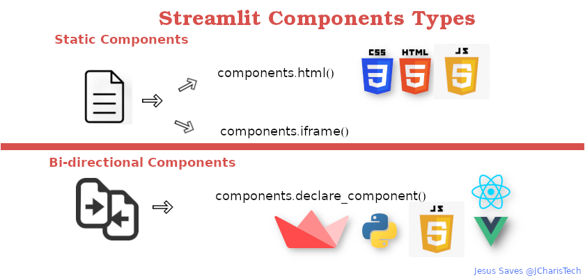
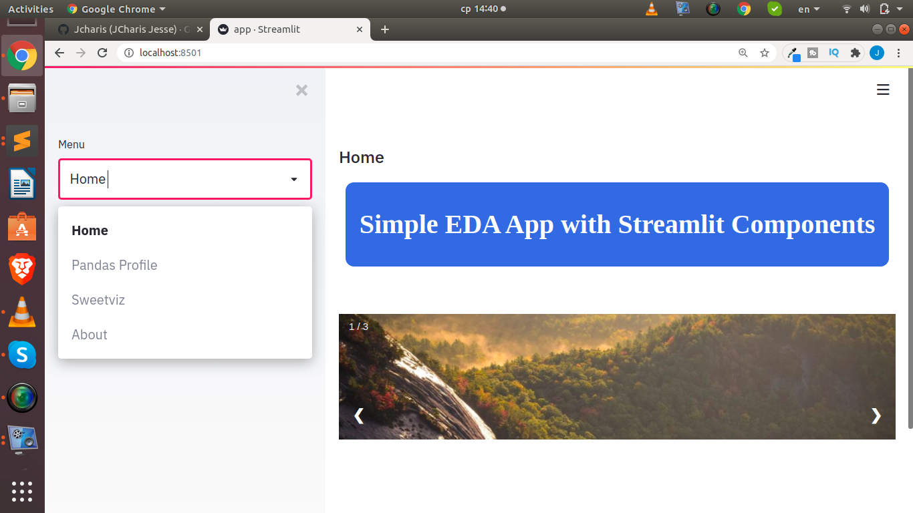
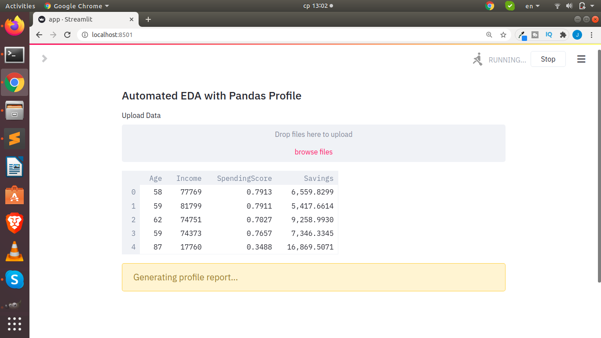
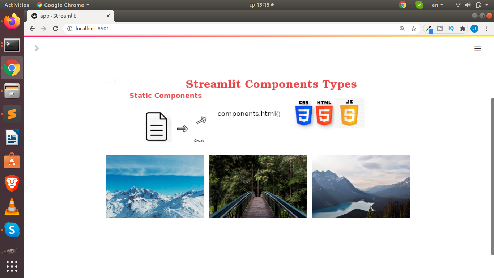

### Using Pandas Profiling & Sweetviz in Streamlit with Streamlit Components
+ How to use pandas profiling and sweetviz in streamlit

#### Simple EDA App
+ Requirements
	- Streamlit version 0.63 and up
	- pandas-profiling
	- sweetviz
	- streamlit-pandas-profiling

#### Streamlit Components Types

#### More on Components
(https://docs.streamlit.io/en/stable/develop_streamlit_components.html)

#### Screenshot

#### Credits
+ @streamlit
+ @ghasel
+ @tconkling
+ @sweetviz

####.
+ Jesus Saves @JCharisTech
+ Jesse E.Agbe(JCharis)